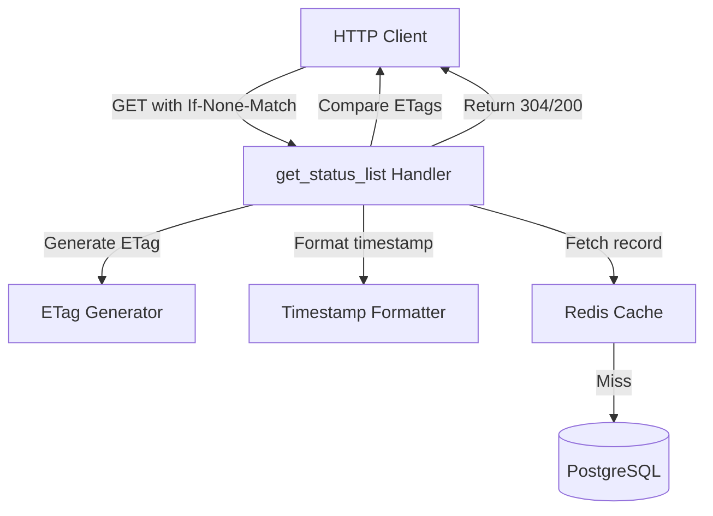

# Design Document: HTTP Caching Headers

## Overview

This design implements HTTP caching headers (Cache-Control, ETag, Last-Modified) and conditional request support (If-None-Match, If-Modified-Since) for the `GET /api/v1/statuslists/{list_id}` endpoint. The feature enables efficient caching by relying parties and CDNs while maintaining content freshness guarantees aligned with the token TTL semantics.

### Problem Statement

The status list server currently returns compressed JWT or CWT tokens with an internal `ttl` field indicating recommended cache lifetime, but lacks corresponding HTTP-level cache directives. This creates a semantic gap between token-level freshness and HTTP caching behavior, preventing effective caching by CDNs and HTTP clients.

### Solution Approach

We implement a layered caching strategy:

1. **ETag Generation**: Compute content-based identifiers from status list data (bits, lst, issuer, sub) using SHA-256 hashing
2. **Cache Directives**: Emit Cache-Control headers with max-age aligned to token_ttl_secs configuration
3. **Conditional Requests**: Support both ETag-based (If-None-Match) and time-based (If-Modified-Since) validation
4. **304 Not Modified**: Return lightweight 304 responses when client cache is fresh
5. **Timestamp Tracking**: Add updated_at field to StatusListRecord for Last-Modified support

### Key Design Decisions

**Why Weak ETags?** We use weak ETags (prefixed with `W/`) because:
- The gzip compression creates byte-level variations for semantically identical content
- [Weak validators](https://developer.mozilla.org/en-US/docs/Web/HTTP/Headers/ETag) indicate semantic equivalence without byte-for-byte identity
- This aligns with [RFC 7232 guidance](https://datatracker.ietf.org/doc/html/rfc7232#section-2.1) for compressed content

**Why Hash Before Compression?** Computing ETags from source data before gzip compression ensures:
- Consistent ETags across different compression levels or algorithms
- [ETag remains stable](https://developers.cloudflare.com/cache/reference/etag-headers/) even if compression middleware changes
- Simpler validation logic that doesn't depend on compression state

**Why Both ETag and Last-Modified?** Supporting both validators provides:
- [ETag as the strong preference](https://http.dev/etag) with precise content-based validation
- Last-Modified as a fallback for simpler clients or debugging
- Compliance with [HTTP caching best practices](https://accreditly.io/articles/the-practical-guide-to-http-caching-headers-cache-control-etag-and-304s)

## Architecture

### Component Overview



### Request Flow

1. **Initial Request** (no conditional headers):
   - Handler fetches StatusListRecord from cache/database
   - Generates ETag from (bits, lst, issuer, sub)
   - Builds token (JWT or CWT) and compresses with gzip
   - Returns 200 with headers: ETag, Last-Modified, Cache-Control, Content-Encoding
   
2. **Conditional Request** (If-None-Match present):
   - Handler fetches StatusListRecord
   - Generates current ETag
   - Compares with If-None-Match value(s)
   - If match: returns 304 with headers (no body)
   - If no match: returns 200 with full token

3. **Time-based Conditional Request** (If-Modified-Since, no If-None-Match):
   - Handler fetches StatusListRecord
   - Compares updated_at with If-Modified-Since timestamp
   - If not modified: returns 304
   - If modified: returns 200 with full token

## Components and Interfaces

### ETag Generator

**Location**: New module `src/web/handlers/status_list/etag.rs`

```rust
/// Computes a weak ETag from status list content
///
/// The ETag is computed from the concatenation of:
/// - bits (as string)
/// - lst (base64url-encoded compressed bitstring)
/// - issuer (string)
/// - sub (string)
///
/// Returns a weak ETag formatted as: W/"<sha256_hex>"
pub fn generate_etag(record: &StatusListRecord) -> String {
    use sha2::{Digest, Sha256};
    
    let mut hasher = Sha256::new();
    hasher.update(record.status_list.bits.to_string().as_bytes());
    hasher.update(record.status_list.lst.as_bytes());
    hasher.update(record.issuer.as_bytes());
    hasher.update(record.sub.as_bytes());
    
    let hash = hasher.finalize();
    format!("W/\"{}\"", hex::encode(hash))
}
```

**Rationale**: SHA-256 provides collision-resistant hashing suitable for cache validation. The weak validator prefix `W/` indicates semantic rather than byte-level equivalence, appropriate for compressed content.

### Conditional Request Evaluator

**Location**: New module `src/web/handlers/status_list/conditional.rs`

```rust
/// Evaluates conditional request headers and determines response status
pub enum ConditionalResponse {
    NotModified,  // Return 304
    Modified,     // Return 200 with body
}

/// Checks If-None-Match header against current ETag
pub fn evaluate_if_none_match(
    if_none_match: Option<&str>,
    current_etag: &str,
) -> ConditionalResponse {
    // Parse comma-separated ETags or wildcard "*"
    // Return NotModified if any ETag matches or wildcard present
}

/// Checks If-Modified-Since header against record timestamp
pub fn evaluate_if_modified_since(
    if_modified_since: Option<&str>,
    updated_at: i64,
) -> ConditionalResponse {
    // Parse HTTP-date format timestamp
    // Return NotModified if record not modified since provided time
}

/// Main conditional request evaluation following RFC 7232 precedence
pub fn evaluate_conditional_request(
    if_none_match: Option<&str>,
    if_modified_since: Option<&str>,
    current_etag: &str,
    updated_at: i64,
) -> ConditionalResponse {
    // If-None-Match takes precedence per RFC 7232 Section 3.2
    if let Some(etag_header) = if_none_match {
        return evaluate_if_none_match(Some(etag_header), current_etag);
    }
    
    // Fall back to If-Modified-Since if no If-None-Match
    evaluate_if_modified_since(if_modified_since, updated_at)
}
```

**Rationale**: Separating conditional evaluation from the handler improves testability and follows RFC 7232 precedence rules (If-None-Match evaluated before If-Modified-Since).

### Timestamp Formatter

**Location**: New utility in `src/web/handlers/status_list/conditional.rs`

```rust
/// Formats Unix timestamp to HTTP-date format (RFC 7231 Section 7.1.1.1)
///
/// Example: "Mon, 27 Jul 2024 12:28:53 GMT"
pub fn format_http_date(unix_timestamp: i64) -> String {
    use time::format_description::well_known::Rfc2822;
    
    let datetime = OffsetDateTime::from_unix_timestamp(unix_timestamp)
        .expect("valid timestamp");
    datetime
        .format(&Rfc2822)
        .expect("valid format")
}

/// Parses HTTP-date format to Unix timestamp
/// Returns None if parsing fails
pub fn parse_http_date(date_str: &str) -> Option<i64> {
    use time::format_description::well_known::Rfc2822;
    
    OffsetDateTime::parse(date_str, &Rfc2822)
        .ok()
        .map(|dt| dt.unix_timestamp())
}
```

**Rationale**: Using the `time` crate's well-known formats ensures RFC compliance and handles edge cases like leap seconds.

### Modified Handler Signature

**Location**: `src/web/handlers/status_list/get_status_list.rs`

The existing handler will be modified to:

1. Extract conditional request headers (If-None-Match, If-Modified-Since)
2. Generate ETag for the fetched StatusListRecord
3. Evaluate conditional request headers
4. Return 304 if conditions met, otherwise build and return full token
5. Include caching headers in all success responses (200 and 304)

```rust
pub async fn get_status_list(
    State(state): State<AppState>,
    Path(list_id): Path<String>,
    headers: HeaderMap,
) -> Result<impl IntoResponse + Debug + use<>, StatusListError> {
    let accept = headers.get(header::ACCEPT).and_then(|h| h.to_str().ok());
    
    // Extract conditional request headers
    let if_none_match = headers
        .get(header::IF_NONE_MATCH)
        .and_then(|h| h.to_str().ok());
    let if_modified_since = headers
        .get(header::IF_MODIFIED_SINCE)
        .and_then(|h| h.to_str().ok());
    
    // Fetch status list record (from cache or database)
    let status_record = fetch_status_record(&list_id, &state).await?;
    
    // Generate ETag from record content
    let current_etag = generate_etag(&status_record);
    
    // Format Last-Modified timestamp
    let last_modified = format_http_date(status_record.updated_at);
    
    // Evaluate conditional request
    match evaluate_conditional_request(
        if_none_match,
        if_modified_since,
        &current_etag,
        status_record.updated_at,
    ) {
        ConditionalResponse::NotModified => {
            // Return 304 with caching headers but no body
            Ok(build_304_response(&state, &current_etag, &last_modified))
        }
        ConditionalResponse::Modified => {
            // Build full token response
            build_full_response(accept, &status_record, &state, &current_etag, &last_modified).await
        }
    }
}
```

### Cache-Control Builder

**Location**: New utility in `src/web/handlers/status_list/get_status_list.rs`

```rust
/// Builds Cache-Control header value for successful responses
fn build_cache_control(token_ttl_secs: u64) -> String {
    format!("public, max-age={}, immutable", token_ttl_secs)
}

/// Builds Cache-Control header value for error responses
fn build_error_cache_control() -> &'static str {
    "no-store, max-age=0"
}
```

**Rationale**: 
- `public` allows CDN caching
- `max-age` matches token TTL for consistent freshness semantics
- `immutable` indicates content won't change during cache lifetime
- `no-store` for errors prevents caching of failure states

## Data Models

### StatusListRecord Extension

**Location**: `src/models.rs`

Add `updated_at` field to track modification time:

```rust
pub mod status_lists {
    use super::*;

    #[derive(Clone, Debug, PartialEq, Eq, DeriveEntityModel, Serialize, Deserialize)]
    #[sea_orm(table_name = "status_lists")]
    pub struct Model {
        #[sea_orm(primary_key)]
        pub list_id: String,
        pub issuer: String,
        #[sea_orm(column_type = "Json")]
        pub status_list: StatusList,
        pub sub: String,
        /// Unix timestamp (seconds) of last modification
        pub updated_at: i64,
    }

    #[derive(Copy, Clone, Debug, EnumIter, DeriveRelation)]
    pub enum Relation {}

    impl ActiveModelBehavior for ActiveModel {}
}
```

### Database Migration

**Location**: `src/database/mod.rs`

Add new migration to add `updated_at` column:

```rust
/// Migration to add updated_at column to status_lists table
pub(crate) mod add_updated_at {
    use super::*;
    
    #[derive(DeriveMigrationName)]
    pub(crate) struct Migration;
    
    #[async_trait::async_trait]
    impl MigrationTrait for Migration {
        async fn up(&self, manager: &SchemaManager) -> Result<(), DbErr> {
            manager
                .alter_table(
                    Table::alter()
                        .table(StatusLists::Table)
                        .add_column(
                            ColumnDef::new(StatusLists::UpdatedAt)
                                .big_integer()
                                .not_null()
                                .default(0)
                        )
                        .to_owned(),
                )
                .await
        }
        
        async fn down(&self, manager: &SchemaManager) -> Result<(), DbErr> {
            manager
                .alter_table(
                    Table::alter()
                        .table(StatusLists::Table)
                        .drop_column(StatusLists::UpdatedAt)
                        .to_owned(),
                )
                .await
        }
    }
    
    #[derive(Iden)]
    enum StatusLists {
        Table,
        UpdatedAt,
    }
}
```

Register this migration in the Migrator:

```rust
impl MigratorTrait for Migrator {
    fn migrations() -> Vec<Box<dyn MigrationTrait>> {
        vec![
            Box::new(tables::Migration),
            Box::new(add_updated_at::Migration),
        ]
    }
}
```

### Update Handlers

**Location**: `src/web/handlers/status_list/publish_status.rs` and `update_status.rs`

Modify PUT and PATCH handlers to set `updated_at` timestamp:

```rust
use time::OffsetDateTime;

// In publish_status (PUT handler):
let updated_at = OffsetDateTime::now_utc().unix_timestamp();
let status_list_record = StatusListRecord {
    list_id: list_id.clone(),
    issuer: issuer.clone(),
    status_list,
    sub: sub.clone(),
    updated_at,
};

// In update_status (PATCH handler):
let mut active_model: status_lists::ActiveModel = record.into();
active_model.status_list = Set(new_status_list);
active_model.updated_at = Set(OffsetDateTime::now_utc().unix_timestamp());
```

## Correctness Properties

*A property is a characteristic or behavior that should hold true across all valid executions of a system—essentially, a formal statement about what the system should do. Properties serve as the bridge between human-readable specifications and machine-verifiable correctness guarantees.*

### Property 1: ETag Determinism

*For any* StatusListRecord, computing the ETag multiple times with identical content SHALL produce identical ETag values.

**Validates: Requirements 1.1**

### Property 2: ETag Field Sensitivity

*For any* StatusListRecord, if any content field (bits, lst, issuer, or sub) changes, the generated ETag SHALL be different from the original ETag.

**Validates: Requirements 1.2, 1.3, 1.4, 1.5**

### Property 3: ETag Format Independence

*For any* StatusListRecord, the generated ETag SHALL be identical regardless of whether the subsequent response will be JWT or CWT format.

**Validates: Requirements 1.6**

### Property 4: ETag Weak Validator Format

*For any* StatusListRecord, the generated ETag SHALL start with the prefix `W/"` and end with `"` (weak validator format per RFC 7232).

**Validates: Requirements 1.7, 1.8**

### Property 5: Conditional Request ETag Matching

*For any* StatusListRecord with ETag E, a request with header `If-None-Match: E` SHALL return status 304 if and only if the current record ETag equals E.

**Validates: Requirements 5.2, 5.3**

### Property 6: Multiple ETag Matching

*For any* StatusListRecord with ETag E, a request with header `If-None-Match: E1, E2, ..., En` where any Ei equals E SHALL return status 304.

**Validates: Requirements 5.6**

### Property 7: Time-based Conditional Request Matching

*For any* StatusListRecord with updated_at timestamp T, a request with header `If-Modified-Since: T_header` SHALL return status 304 if and only if T ≤ T_header (record not modified after client cache time).

**Validates: Requirements 6.2, 6.3**

### Property 8: HTTP-date Format Validity

*For any* valid Unix timestamp value, formatting it as HTTP-date SHALL produce a string that can be parsed back to the same timestamp (round-trip property).

**Validates: Requirements 4.3**

### Property 9: Invalid Conditional Header Tolerance

*For any* malformed If-None-Match or If-Modified-Since header value, the handler SHALL treat it as absent and return status 200 with full content.

**Validates: Requirements 10.1, 10.2**

## Error Handling

### Error Response Cache Behavior

All error responses (4xx and 5xx status codes) SHALL include:
- `Cache-Control: no-store, max-age=0` - prevents caching of error states
- NO ETag or Last-Modified headers - errors are not cacheable entities

Specific error cases:
- **404 Not Found**: Status list does not exist - include no-store directive
- **500 Internal Server Error**: Server-side failures - include no-store directive  
- **503 Service Unavailable**: Certificate not provisioned - include no-store directive

**Rationale**: Error states should not be cached because:
- Temporary failures (500, 503) may resolve quickly
- Prevents stale error responses from being served by CDNs
- Aligns with [HTTP caching best practices for errors](https://http.dev/304)

### Malformed Header Handling

When conditional request headers contain invalid syntax:

1. **Invalid ETag syntax** (missing quotes, invalid characters):
   - Log warning: `"Malformed If-None-Match header: {value}"`
   - Treat header as absent
   - Return 200 with full response

2. **Invalid date format** (unparseable timestamp):
   - Log warning: `"Malformed If-Modified-Since header: {value}"`
   - Treat header as absent
   - Return 200 with full response

3. **Future dates** in If-Modified-Since:
   - Log warning: `"If-Modified-Since contains future date: {value}"`
   - Treat as modified (return 200)
   - Rationale: Client clock skew or malicious input should not prevent content delivery

### Content encoding errors

If gzip compression fails (should be rare):
- Log error with context
- Return 500 Internal Server Error  
- Include no-store Cache-Control directive

## Testing Strategy

### Unit Tests

Focus on specific behaviors and edge cases:

**ETag Generation**:
- Generate ETag for specific known record, verify exact value
- Verify weak validator prefix and quote format
- Test with empty strings, special characters in issuer/sub
- Test with maximum length lst values

**Conditional Evaluation**:
- Test If-None-Match with single ETag (match and no-match)
- Test If-None-Match with multiple ETags
- Test If-None-Match with wildcard `*`
- Test If-Modified-Since with various timestamps (before, equal, after)
- Test precedence when both headers present
- Test malformed header handling (invalid syntax, invalid dates, future dates)

**HTTP-date Formatting**:
- Format known timestamps and verify against expected strings
- Parse various valid RFC 2822 date formats
- Test parsing invalid formats returns None
- Test edge cases (Unix epoch, far future dates)

**Cache-Control Building**:
- Verify success response includes public, max-age={ttl}, immutable
- Verify error response includes no-store, max-age=0

**Handler Integration**:
- Test 200 response includes ETag, Last-Modified, Cache-Control
- Test 304 response includes headers but no body
- Test error responses include no-store Cache-Control
- Test both JWT and CWT formats receive same caching headers
- Test cache hit and miss both include ETag

### Property-Based Tests

Verify universal properties using [quickcheck](https://crates.io/crates/quickcheck) with minimum 100 iterations:

**Property Test 1: ETag Determinism**
```rust
// Feature: http-caching-headers, Property 1: ETag Determinism
#[quickcheck]
fn prop_etag_determinism(record: StatusListRecord) -> bool {
    let etag1 = generate_etag(&record);
    let etag2 = generate_etag(&record);
    etag1 == etag2
}
```

**Property Test 2: ETag Field Sensitivity**
```rust
// Feature: http-caching-headers, Property 2: ETag Field Sensitivity
#[quickcheck]
fn prop_etag_field_sensitivity(mut record: StatusListRecord, field_to_change: FieldChoice) -> bool {
    let original_etag = generate_etag(&record);
    
    // Modify one field based on field_to_change
    match field_to_change {
        FieldChoice::Bits => record.status_list.bits = record.status_list.bits.wrapping_add(1),
        FieldChoice::Lst => record.status_list.lst.push('x'),
        FieldChoice::Issuer => record.issuer.push('x'),
        FieldChoice::Sub => record.sub.push('x'),
    }
    
    let new_etag = generate_etag(&record);
    original_etag != new_etag
}
```

**Property Test 3: ETag Format Independence**
```rust
// Feature: http-caching-headers, Property 3: ETag Format Independence  
#[quickcheck]
fn prop_etag_format_independence(record: StatusListRecord) -> bool {
    // Generate ETag before any format-specific processing
    let etag_before_jwt = generate_etag(&record);
    let etag_before_cwt = generate_etag(&record);
    etag_before_jwt == etag_before_cwt
}
```

**Property Test 4: ETag Weak Validator Format**
```rust
// Feature: http-caching-headers, Property 4: ETag Weak Validator Format
#[quickcheck]
fn prop_etag_weak_format(record: StatusListRecord) -> bool {
    let etag = generate_etag(&record);
    etag.starts_with("W/\"") && etag.ends_with('"')
}
```

**Property Test 5: Conditional Request ETag Matching**
```rust
// Feature: http-caching-headers, Property 5: Conditional Request ETag Matching
#[quickcheck]
fn prop_conditional_etag_match(record: StatusListRecord, etag_matches: bool) -> bool {
    let current_etag = generate_etag(&record);
    let if_none_match = if etag_matches {
        current_etag.clone()
    } else {
        format!("W/\"different_hash\"")
    };
    
    let result = evaluate_if_none_match(Some(&if_none_match), &current_etag);
    matches!(result, ConditionalResponse::NotModified) == etag_matches
}
```

**Property Test 6: Multiple ETag Matching**
```rust
// Feature: http-caching-headers, Property 6: Multiple ETag Matching
#[quickcheck]
fn prop_multiple_etag_match(record: StatusListRecord, include_current: bool) -> bool {
    let current_etag = generate_etag(&record);
    let mut etags = vec![
        "W/\"aaaa\"".to_string(),
        "W/\"bbbb\"".to_string(),
    ];
    if include_current {
        etags.push(current_etag.clone());
    }
    
    let if_none_match = etags.join(", ");
    let result = evaluate_if_none_match(Some(&if_none_match), &current_etag);
    matches!(result, ConditionalResponse::NotModified) == include_current
}
```

**Property Test 7: Time-based Conditional Request Matching**
```rust
// Feature: http-caching-headers, Property 7: Time-based Conditional Request Matching
#[quickcheck]
fn prop_time_based_conditional(updated_at: i64, offset_secs: i64) -> bool {
    let client_time = updated_at.saturating_add(offset_secs);
    let client_time_str = format_http_date(client_time);
    
    let result = evaluate_if_modified_since(Some(&client_time_str), updated_at);
    let should_be_not_modified = client_time >= updated_at;
    matches!(result, ConditionalResponse::NotModified) == should_be_not_modified
}
```

**Property Test 8: HTTP-date Format Validity**
```rust
// Feature: http-caching-headers, Property 8: HTTP-date Format Validity
#[quickcheck]
fn prop_http_date_roundtrip(timestamp: i64) -> bool {
    // Filter out invalid timestamps (far future/past may not format correctly)
    if timestamp < 0 || timestamp > 4_000_000_000 {
        return true; // Skip invalid range
    }
    
    let formatted = format_http_date(timestamp);
    let parsed = parse_http_date(&formatted);
    parsed == Some(timestamp)
}
```

**Property Test 9: Invalid Conditional Header Tolerance**
```rust
// Feature: http-caching-headers, Property 9: Invalid Conditional Header Tolerance
#[quickcheck]
fn prop_invalid_header_tolerance(record: StatusListRecord, invalid_header: String) -> bool {
    // Generate various invalid ETag formats
    let invalid_etag = if invalid_header.is_empty() {
        "not_quoted"
    } else {
        &invalid_header // Random string unlikely to be valid ETag
    };
    
    let current_etag = generate_etag(&record);
    let result = evaluate_if_none_match(Some(invalid_etag), &current_etag);
    
    // Invalid headers should be treated as absent, returning Modified
    matches!(result, ConditionalResponse::Modified)
}
```

### Integration Tests

Test end-to-end behavior with real HTTP requests:

- **Full request cycle**: Create status list, GET with various headers, verify responses
- **Database timestamp persistence**: Create/update list, verify updated_at stored and retrieved
- **Cache integration**: Verify ETag present for both cache hits and misses
- **Logging verification**: Send malformed headers, verify warnings in logs
- **Multiple format consistency**: Request same list as JWT and CWT, verify identical ETags

### Performance Testing

Verify caching improves performance under load:

- **Baseline**: Measure p95 latency without conditional requests
- **With caching**: Measure p95 latency when 80% requests are 304 responses
- **Expected improvement**: 304 responses should be significantly faster (no token generation/compression)
- **CDN simulation**: Use artillery tests with conditional request headers

## Implementation Notes

### Dependencies

Add to `Cargo.toml`:

```toml
[dependencies]
sha2 = "0.10"  # For ETag generation
hex = "0.4"    # For hexadecimal encoding
time = { version = "0.3", features = ["formatting", "parsing"] }  # Already present, ensure formatting/parsing features
```

### Backward Compatibility

This feature is **fully backward compatible**:
- Clients not sending conditional headers receive normal 200 responses (existing behavior)
- New headers (ETag, Last-Modified, Cache-Control) are additive and don't break existing clients
- Database migration adds non-nullable column with default value 0
- Existing records will have updated_at=0 until next update (acceptable: Last-Modified will work correctly after first update)

### Deployment Strategy

1. **Phase 1**: Deploy database migration to add updated_at column
2. **Phase 2**: Deploy code changes to populate updated_at on writes
3. **Phase 3**: Enable ETag/conditional request support
4. **Phase 4**: Monitor cache hit rates and 304 response metrics

### Monitoring

Add metrics to track:
- `http_conditional_requests_total{result="not_modified|modified"}` - Count of conditional request evaluations
- `http_304_responses_total` - Count of 304 responses served
- `http_cache_hit_ratio` - Ratio of 304 to total successful responses
- `etag_generation_duration_seconds` - Latency of ETag computation

### Security Considerations

**ETag as fingerprint**: ETags reveal information about content without authentication. This is acceptable because:
- Status lists are public data (already served without authentication)
- ETags don't leak sensitive information (just a hash indicating content version)
- Aligns with OAuth Status List specification semantics

**Timestamp precision**: Using second-level precision (not milliseconds) prevents:
- Timing attacks based on microsecond-level observations
- Database compatibility issues across different systems

**Malformed input handling**: Treating malformed headers as absent (rather than erroring) prevents:
- Denial of service via malformed requests
- Accidental outages from buggy clients

## Future Enhancements

### Vary Header Support

Currently not implemented, but future consideration:
- Add `Vary: Accept` header to indicate JWT vs CWT creates different representations
- Enables more sophisticated caching of format variants
- Complexity: requires tracking format-specific ETags if compression differs

### Stale-While-Revalidate

Consider adding `stale-while-revalidate` directive:
- Allows serving slightly stale content while fetching fresh copy
- Improves perceived performance during cache revalidation
- Complexity: requires careful TTL tuning to avoid serving very stale data

### Compression Algorithm Flexibility

Future support for Brotli or Zstd compression:
- ETag design (hash before compression) naturally supports this
- Would need to add Content-Encoding negotiation logic
- Consider performance vs compatibility tradeoffs
