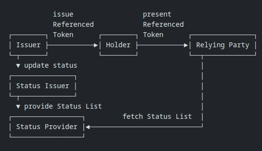

## **Status List Server: Developer Guide and Architecture Documentation**

### **1. Introduction**
   - **Purpose**: The Status List Server is a service that provides **Status List Tokens** to Relying Parties for verifying the status of Referenced Tokens (e.g., OAuth 2.0 tokens). It enables efficient and scalable token status management.
   - **Key Features**:
     - Serve Status List Tokens in JWT or CWT format.
     - Support for high-frequency status updates.
     - Scalable and secure architecture.
   - **Audience**: This guide is intended for developers integrating with the Status List Server, including Relying Parties and Token Issuers.


### **2. Architecture Overview**
 **High-Level Diagram**: 
    

   - **Components**:
     1. **Token Issuer**: Issues Referenced Tokens with a `status` claim pointing to the Status List Server.
     2. **Status List Server**: Hosts and serves Status List Tokens containing token statuses.
     3. **Relying Party**: Requests and uses Status List Tokens to verify the status of Referenced Tokens.

### **3. Workflows**
   - **Token Issuance**:
     1. The **Token Issuer** creates a Referenced Token with a `status` claim containing:
        - `status_list.url`: The URL of the Status List Server.
        - `status_list.index`: The index of the token's status in the Status List Token.
     2. The Referenced Token is sent to the client.

   - **Status List Token Retrieval**:
     1. The **Relying Party** extracts the `status` claim from the Referenced Token.
     2. It sends an HTTP GET request to the `status_list.url` with an `Accept` header (`application/statuslist+jwt` or `application/statuslist+cwt`).
     3. The **Status List Server** responds with the Status List Token in the requested format.

   - **Token Status Verification**:
     1. The **Relying Party** decodes the Status List Token (JWT or CWT).
     2. It uses the `status_list.index` to locate the token's status in the Status List Token.
     3. The status is used to determine if the Referenced Token is valid, revoked, or expired.

### **4. API Specifications**
   - **Endpoint**: `/statuslists/{issuer}`
   - **Method**: `GET`
   - **Request Headers**:
     - `Accept`: `application/statuslist+jwt` or `application/statuslist+cwt`.
   - **Response**:
     - **Status Code**: `200 OK` (success) or `404 NOT FOUND` (issuer not found).
     - **Headers**:
       - `Content-Type`: `application/statuslist+jwt` or `application/statuslist+cwt`.
       - `Content-Encoding`: `gzip` (optional, for compression).
     - **Body**: The Status List Token in JWT or CWT format.
   
   - **Endpoint**: `/statuslists/{issuer}`
   - **Method**: `POST`
   - **Description**: Allows an issuer to publish token statuses from which a status list will be created.
   - **Authorization**: Requires a valid signed JWT with the issuer scope.
   - **Request Body**:
     ```json
     [
       { "index": 1, "status": "INVALID" },
       { "index": 8, "status": "VALID" }
     ]
     ```
   - **Response**:
     - **Status Code**: `201 Created` (success), `400 Bad Request` (invalid data), `401 Unauthorized`, or `403 Forbidden`.

   - **Endpoint**: `/statuslists/{issuer}`
   - **Method**: `PUT`
   - **Description**: Allows an issuer to update an existing status list.
   - **Authorization**: Requires a valid signed JWT with the issuer scope.
   - **Request Body**:
     ```json
     {
       "updates": [
         { "index": 1, "status": "VALID" },
         { "index": 8, "status": "INVALID" }
       ]
     }
     ```
   - **Response**:
     - **Status Code**: `200 OK` (success), `400 Bad Request` (invalid data), `401 Unauthorized`, `403 Forbidden`, or `404 Not Found`.

### **5. Data Formats**
   - **Referenced Token**:
     ```json
     {
       "iss": "https://issuer.example.com",
       "sub": "user123",
       "status": {
         "status_list": {
           "url": "https://statuslist.example.com/statuslists/1",
           "index": 42
         }
       }
     }
     ```

   - **Status List Token (JWT Example)**:
     ```json
     {
       "iss": "https://issuer.example.com",
       "sub": "https://statuslist.example.com/statuslists/1",
       "status_list": {
         "bits": 1,
         "lst": "eyJhbGciOiJFUzI1NiIsImtpZCI6IjEyIiwidHlwIjoic3RhdHVzbGlzdCtqd3QifQ..."
       },
       "exp": 2291720170,
       "ttl": 43200
     }
     ```
   - **Status List Token (CWT Example)**:
   ```
  d2845820a2012610781a6170706c69636174696f6e2f7374617475736c6973742b63
   7774a1044231325850a502782168747470733a2f2f6578616d706c652e636f6d2f73
   74617475736c697374732f31061a648c5bea041a8898dfea19fffe19a8c019fffda2
   646269747301636c73744a78dadbb918000217015d5840251d844ecc6541b8b2fd24
   e681836c1a072cad61716fb174d57b162b4b392c1ea08b875a493ca8d1cf4328eee1
   b14f33aa899e532844778ba2fff80b5c1e56e5
   ``` 

Here’s how you can add an **Application Design** section to the **developer guide and architecture documentation** for the **Status List Server**. This section will explain the **tech stack** used, the architecture, and how the components interact.


## **7. Application Design**

This section provides an overview of the **technology stack** and **design principles** used to build the Status List Server.


### **7.1. Tech Stack**
The Status List Server is built using modern, performant, and scalable technologies. Below is the tech stack used:

#### **Web Framework**
   - **Axum**: web application framework that focuses on ergonomics and modularity

#### **Data Serialization**
   - **Serde**: A powerful serialization framework for Rust, used to serialize and deserialize JSON data (e.g., Status List Tokens, credentials).

#### **Token Encoding/Decoding**
   - **JSON Web Tokens (JWT)**: Used for encoding and decoding Status List Tokens. The `jsonwebtoken` crate is used for JWT operations.

#### **Storage**
   - **Database**: to map and store statuslist to id and credentials.

### **7.2. Data Flow**
The data flow in the Status List Server is as follows:

1. **Token Issuer**:
   - Issues a Referenced Token with a `status` claim containing the Status List URL and index.
   - signs and update status list token to corresponding jwt or cwt before sending to status list server
   - Sends a request to update the token status when necessary.

2. **Relying Party**:
   - Receives the Referenced Token and extracts the `status` claim.
   - Requests the Status List Token from the Status List Server.
   - Validates the status list.
   - Decodes the Status List Token and verifies the token's status.

3. **Status List Server**:
   - Receives requests from Token Issuers and Relying Parties.
   - Updates token statuses in the Status List.
   - Serves Status List Tokens to Relying Parties.

### **8. Security Considerations**
   - **HTTPS**: All communication with the Status List Server must use HTTPS to ensure data integrity and confidentiality.
   - **Token Signing**: Status List Tokens must be signed (e.g., using JWT or CWT) to prevent tampering.
   - **CORS**: The Status List Server should support Cross-Origin Resource Sharing (CORS) for browser-based clients.
   - **Rate Limiting**: Implement rate limiting to prevent abuse of the Status List Server.

### **9. Developer Integration**
   - **Step 1**: Configure the Token Issuer to include the `status` claim in Referenced Tokens.
   - **Step 2**: Implement the Relying Party to:
     1. Extract the `status` claim from the Referenced Token.
     2. Request the Status List Token from the Status List Server.
     3. Decode and verify the Status List Token.
     4. Use the `index` to check the token's status.
   - **Step 3**: Test the integration using sample Referenced Tokens and Status List Tokens.

### **10. Troubleshooting**
   - **Common Issues**:
     - Invalid `status_list.url` in the Referenced Token.
     - Missing or incorrect `Accept` header in the request.
     - Expired or invalid Status List Token.
   - **Debugging Tips**:
     - Check HTTP response codes and headers.
     - Validate the structure of the Referenced Token and Status List Token.

### **11. References**
   - [IETF Draft: OAuth Status List](https://datatracker.ietf.org/doc/draft-ietf-oauth-status-list/)
   - [JWT (JSON Web Token) RFC 7519](https://tools.ietf.org/html/rfc7519)
   - [CWT (CBOR Web Token) RFC 8392](https://tools.ietf.org/html/rfc8392)
