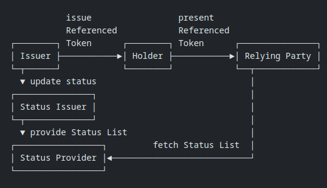

# Status List Server: Developer Guide and Architecture Documentation

## Introduction

- **Purpose**: The Status List Server is a service that provides **Status List Tokens** to Relying Parties for verifying the status of Referenced Tokens (e.g., OAuth 2.0 tokens). It enables efficient and scalable token status management.
- **Key Features**:
  - Serve Status List Tokens in JWT or CWT format.
  - Support for high-frequency status updates.
  - Scalable and secure architecture.
- **Audience**: This guide is intended for developers integrating with the Status List Server, including Relying Parties and Token Issuers.

## Architecture Overview

**High-Level Diagram**:



- **Components**:
  1. **Token Issuer**: Issues Referenced Tokens with a `status` claim pointing to the Status List Server.
  2. **Status List Server**: Hosts and serves Status List Tokens containing token statuses.
  3. **Relying Party**: Requests and uses Status List Tokens to verify the status of Referenced Tokens.

## Workflows

- **Token Issuance**:
  1. The **Token Issuer** creates a Referenced Token with a `status` claim containing:
     - `status_list.url`: The URL of the Status List Server.
     - `status_list.index`: The index of the token's status in the Status List Token.
  2. The Referenced Token is sent to the client.

- **Status List Token Retrieval**:
  1. The **Relying Party** extracts the `status` claim from the Referenced Token.
  2. It sends an HTTP GET request to the `status_list.url` with an optional `Accept` header (`application/statuslist+jwt` or `application/statuslist+cwt`).
  3. The **Status List Server** responds with the gzip compressed Status List Token in the requested format.

- **Token Status Verification**:
  1. The **Relying Party** decompresses and decodes the Status List Token (JWT or CWT).
  2. It uses the `status_list.index` to locate the token's status in the Status List Token.
  3. The status is used to determine if the Referenced Token is valid, revoked, or expired.

## Data Formats

- **Referenced Token**:

  ```json
  {
    "iss": "https://issuer.example.com",
    "sub": "user123",
    "status": {
      "status_list": {
        "url": "https://statuslist.example.com/api/v1/status-lists/1",
        "index": 42
      }
    }
  }
  ```

- **Status List Token (JWT Example)**:

  ```json
  {
    "iss": "https://issuer.example.com",
    "sub": "https://statuslist.example.com/api/v1/status-lists/1",
    "status_list": {
      "bits": 1,
      "lst": "eyJhbGciOiJFUzI1NiIsImtpZCI6IjEyIiwidHlwIjoic3RhdHVzbGlzdCtqd3QifQ..."
    },
    "exp": 2291720170,
    "ttl": 43200
  }
  ```

- **Status List Token (CWT Example)**:

  ```hex
  d2845820a2012610781a6170706c69636174696f6e2f7374617475736c6973742b63
  7774a1044231325850a502782168747470733a2f2f6578616d706c652e636f6d2f73
  74617475736c697374732f31061a648c5bea041a8898dfea19fffe19a8c019fffda2
  646269747301636c73744a78dadbb918000217015d5840251d844ecc6541b8b2fd24
  e681836c1a072cad61716fb174d57b162b4b392c1ea08b875a493ca8d1cf4328eee1
  b14f33aa899e532844778ba2fff80b5c1e56e5
  ```

## Application Design

This section provides an overview of the **technology stack** and **design principles** used to build the Status List Server.

### Tech Stack

The Status List Server is built using modern, performant, and scalable technologies. Below is the tech stack used:

#### Web Framework

- **Axum**: web application framework that focuses on ergonomics and modularity

#### Data Serialization

- **Serde**: A powerful serialization framework for Rust, used to serialize and deserialize JSON data (e.g., Status List Tokens, credentials).

#### Token Encoding/Decoding

- **jsonwebtoken**: Used for encoding and decoding Status List Tokens in JWT (JSON Web Token) format.
- **coset**: Used for encoding and decoding Status List Tokens in CWT (CBOR Web Token) format.

#### Storage

- **Database**: to map and store status lists (keyed by `list_id`) and issuer credentials (keyed by `issuer`). See [Database Overview](../src/database/README.md) for the schema.

### Data Flow

The data flow in the Status List Server is as follows:

1. **Token Issuer**:
   - Issues a Referenced Token with a `status` claim containing the Status List URL and index.
   - signs and update status list token to corresponding jwt or cwt before sending to status list server
   - Sends a request to update the token status when necessary.

2. **Relying Party**:
   - Receives the Referenced Token and extracts the `status` claim.
   - Requests the Status List Token from the Status List Server.
   - Validates the status list.
   - Decodes the Status List Token and verifies the token's status.

3. **Status List Server**:
   - Receives requests from Token Issuers and Relying Parties.
   - Updates token statuses in the Status List.
   - Serves Status List Tokens to Relying Parties.

## Security Considerations

- **HTTPS**: All communication with the Status List Server must use HTTPS to ensure data integrity and confidentiality.
- **Token Signing**: Status List Tokens must be signed (e.g., using JWT or CWT) to prevent tampering.
- **CORS**: The Status List Server supports Cross-Origin Resource Sharing (CORS) for browser-based clients.
- **Bearer Authentication**: Management endpoints (`PUT`/`PATCH /api/v1/status-lists/{list_id}/statuses`) are protected by a JWT Bearer middleware (`auth`) that validates the signature against the JWK registered for the issuer and checks that the `iss` claim matches the registered issuer.
- **Rate Limiting & Request Bounds**: The server applies layered defense-in-depth controls to prevent abuse. See [Rate Limiting & Request Bounds](#rate-limiting--request-bounds) below.

## Rate Limiting & Request Bounds

The server enforces two complementary layers of abuse protection, both
operator-configurable through environment variables prefixed with `APP_`.

### Rate-limiting tiers (`APP_RATE_LIMIT__*`)

A token-bucket governor (`tower-governor`) is applied per route group, with
each tier keyed and tuned independently:

| Tier           | Routes                                                          | Key                                                                           | Tunables (defaults)                                           |
| ----           | ------                                                          | ---                                                                           | -------------------                                           |
| **strict**     | `POST /api/v1/credentials`                                      | source IP                                                                     | `strict_burst_size` (10), `strict_period_secs` (60s)          |
| **per-issuer** | `PUT`/`PATCH /api/v1/status-lists/{list_id}/statuses`           | JWT `iss` claim, falling back to source IP when the token is absent/malformed | `strict_burst_size` (10), `strict_period_secs` (60s)          |
| **permissive** | `GET /api/v1/aggregation`, `GET /api/v1/status-lists/{list_id}` | source IP                                                                     | `permissive_burst_size` (100), `permissive_period_secs` (60s) |

The per-issuer tier is applied **behind** the `auth` middleware, so a valid
authenticated issuer determines the bucket. When a bucket is exhausted the
server returns `429 Too Many Requests` with a plain-text body
`Too Many Requests! Wait for <n>s` (emitted by the governor middleware; it is
not RFC 7807 problem+json).

### Request & persistence bounds (`APP_LIMITS__*`)

Beyond rate limiting, hard bounds cap incoming request size and the size of
persisted status lists:

| Bound                      | Default | Exceeded response                     | Where enforced                       |
| -----                      | ------- | ------------------                    | --------------                       |
| `max_body_size_bytes`      | 2 MiB   | `413 Payload Too Large`               | `RequestBodyLimitLayer` (all routes) |
| `max_status_index`         | 100000  | `400 Bad Request` — `index` too large | publish / update handlers            |
| `max_statuses_per_request` | 5000    | `400 Bad Request` — too many entries  | publish / update handlers            |
| `max_serialized_list_size` | 1 MiB   | `422 Unprocessable Entity`            | list creation/update (`lst_gen`)     |

These bounds protect the server from oversized payloads and unbounded list
growth. The default schema maximums (`StatusEntry.index.maximum`,
`StatusUpdateRequest.statuses.maxItems`) document the defaults; operators who
lower a bound via configuration should treat the documented maximums as
defaults, not guarantees.

### Error response summary

| Status | Meaning                                                               |
| ------ | -------                                                               |
| `400`  | Malformed/invalid request, or an enforced count/index bound exceeded  |
| `401`  | Missing or invalid Bearer token                                       |
| `403`  | Authenticated issuer does not own the list                            |
| `404`  | Status list not found                                                 |
| `406`  | Unsupported `Accept` value                                            |
| `409`  | List/credentials already exist                                        |
| `413`  | Request body exceeds `max_body_size_bytes`                            |
| `422`  | Serialized list exceeds `max_serialized_list_size`, or unparsable JWK |
| `429`  | Rate-limit quota exhausted                                            |
| `500`  | Internal server error                                                 |
| `503`  | Service temporarily unavailable                                       |

Handler-level errors use RFC 7807 `application/problem+json`; the body also
carries `Cache-Control: no-store, max-age=0` so error states are not cached.

## Developer Integration

- **Step 1**: Configure the Token Issuer to include the `status` claim in Referenced Tokens.
- **Step 2**: Implement the Relying Party to:
  1. Extract the `status` claim from the Referenced Token.
  2. Request the Status List Token from the Status List Server.
  3. Decode and verify the Status List Token.
  4. Use the `index` to check the token's status.
- **Step 3**: Test the integration using sample Referenced Tokens and Status List Tokens.

## Troubleshooting

- **Common Issues**:
  - Invalid `status_list.url` in the Referenced Token.
  - Incorrect `Accept` header in the request.
  - Expired or invalid Status List Token.
- **Debugging Tips**:
  - Check HTTP response codes and headers.
  - Validate the structure of the Referenced Token and Status List Token.

## References

- [IETF Draft: OAuth Status List](https://datatracker.ietf.org/doc/draft-ietf-oauth-status-list/)
- [JWT (JSON Web Token) RFC 7519](https://tools.ietf.org/html/rfc7519)
- [CWT (CBOR Web Token) RFC 8392](https://tools.ietf.org/html/rfc8392)
