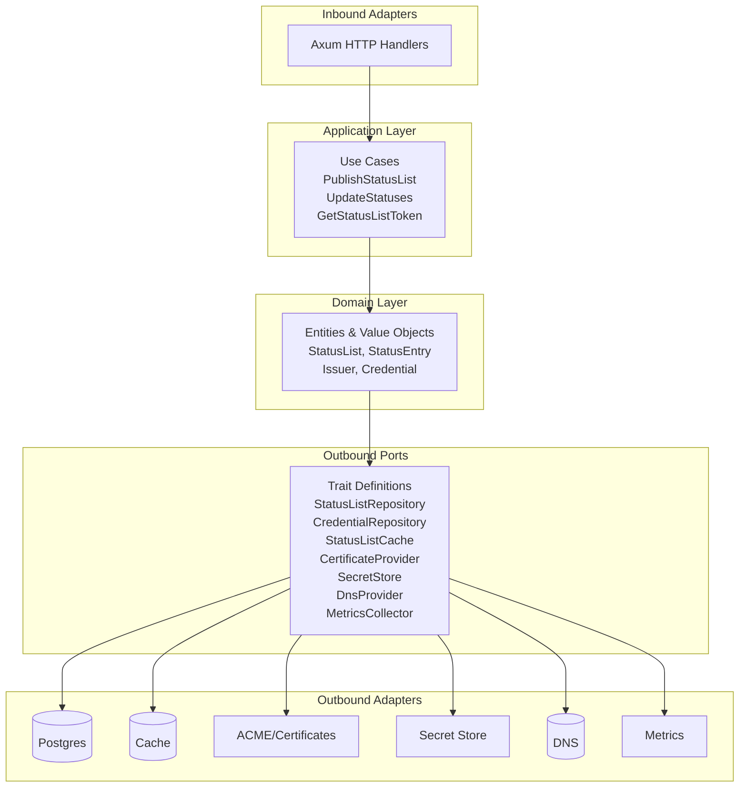

# Hexagonal architecture

The service follows ports-and-adapters boundaries for new work:

`src/domain` contains status-list and issuer values plus the status-list
bitstring creation/update invariants. It only depends on serialization and
pure encoding/compression helpers. `src/application` implements the inbound
use cases (`PublishStatusList`, `UpdateStatuses`, and `GetStatusListToken`) in
terms of traits in `src/ports`. It must not import Axum, SeaORM, Redis, AWS
SDKs, or other infrastructure crates.

Concrete integrations belong in `src/adapters`. The current default SQL
implementation is `adapters::postgres::PostgresStatusListRepository`; the
cache implementation is `adapters::cache::MokaStatusListCache`; certificate,
secret-store, DNS, metrics, and memory implementations also live under
`src/adapters`. The memory adapters are used to unit-test use cases without
services. The composition root (`utils::state::build_state`) injects adapter
trait objects into `AppState`; handlers receive ports and configuration only.

Adapter feature selection belongs at the composition root. This makes a
memory-only composition possible without altering domain or application code.
The default `server` feature selects the HTTP and Postgres/Redis/AWS stack;
`cargo check --no-default-features --features memory-only` compiles without
those infrastructure dependencies.
