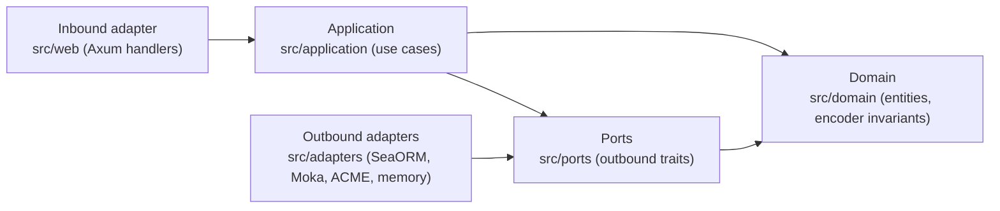

# Hexagonal architecture

The service is structured as ports and adapters. Four layers, one rule.

## The dependency rule

Dependencies point **inward only**:

- `src/domain` depends on **nothing** in this codebase and on no
  infrastructure crate — no Axum, no SeaORM, no Redis, no AWS SDK.
- `src/ports` depends only on `src/domain` (trait definitions are typed
  entirely in domain values).
- `src/application` depends on `src/domain` and `src/ports` — never on an
  adapter, a database client, or an HTTP framework.
- `src/adapters` and `src/web` depend on the inner layers, never the other
  way around.

If a change requires an inner layer to name a type from an outer one, the
change is wrong: either the type belongs in the domain, or the dependency
must be inverted through a port trait.



Note the arrow directions: the **domain points at nothing**, and adapters
*implement* port traits rather than being called directly.

## Layers

### `src/domain`

Entities and value objects: `StatusList`, `StatusEntry`, `Status`, `Issuer`,
`Credential`, `PublicJwk`, `StatusListRecord`, `StatusListSnapshot`. It also
owns the status-list bitstring invariants — bit-packing, zlib + base64url
encoding, bit-width widening, and rejection of reserved status values — with
the IETF §4.1/§4.2 worked vectors pinned byte-for-byte in its test suite.

### `src/ports`

Outbound trait definitions: `StatusListRepository`, `CredentialRepository`,
`StatusListCache`, `CertificateProvider`, and (feature-gated with the SQL
backends) `StatusListHistoryRepository`. `StatusListRepository::update` takes
an `expected_updated_at` guard: implementations must persist only when the
stored stamp still matches, which is how the lost-update protection crosses
the port boundary.

### `src/application`

Inbound use cases: `PublishStatusList`, `UpdateStatuses`,
`GetStatusListToken`, plus the `*WithHistory` variants and the
`StatusListService` / `CredentialService` trait objects handlers consume.
Use cases own cross-entity invariants: existence checks, issuer ownership,
the serialized-size bound, snapshot recording, and the optimistic-concurrency
stamp (`next_updated_at` — strictly advancing so the guard always moves, even
for two writes in the same second).

### `src/adapters`

One module per integration: `sea_orm` (Postgres/MySQL/SQLite repositories),
`cache` (Moka in-process status-list cache; `ttl = 0` disables it),
`certificate` (bridges the ACME `CertManager` to `CertificateProvider`),
`aws` / `redis` (certificate-manager storage backends), and `memory`
(in-memory implementations used by application-service unit tests and the
`memory-only` build). The memory repository implements the same
compare-and-swap semantics as the SQL adapter so concurrency behavior is
testable without a database.

### Composition root

`utils::state::build_state` is the only place adapters are constructed and
the only place feature selection happens. It injects trait objects into
`AppState`; handlers receive ports and configuration, never concrete clients.
Historical snapshots are wired only when `history_retention_secs > 0` — a
retention of zero composes the service without a history repository rather
than checking a flag on every request.

## Error handling across the boundaries

Each layer translates errors at its own boundary; driver detail never crosses
into a response body:

1. Driver/SDK errors become `RepositoryError` (`src/database/error.rs`);
   unique-key violations are normalized to `DuplicateEntry` via SeaORM's
   backend-independent `sql_err()`.
2. Adapters map those to semantic `PortError` values
   (`StorageUnavailable { operation, detail }`, `Conflict`, `InvalidData`) —
   `detail` is for logs, not clients.
3. Use cases surface `UseCaseError` (`AlreadyExists`, `NotFound`,
   `IssuerMismatch`, `Conflict`, `StatusListTooLarge`, …). A duplicate-key
   `Conflict` on the insert path becomes `AlreadyExists`, so a racing publish
   returns 409 rather than 500.
4. Handlers match `UseCaseError` variants into `StatusListError` /
   `CredentialError`, which convert to the `ApiError` JSON envelope with the
   appropriate status code and `Cache-Control: no-store`.

## Verifying the boundaries

The default `server` feature selects the HTTP + Postgres/Redis/AWS stack. The
infrastructure-free composition — domain, ports, application services, and
memory adapters only — is enforced in CI:

```bash
cargo test --lib --no-default-features --features memory-only
```

If that build breaks, an inner layer has grown an infrastructure dependency.
