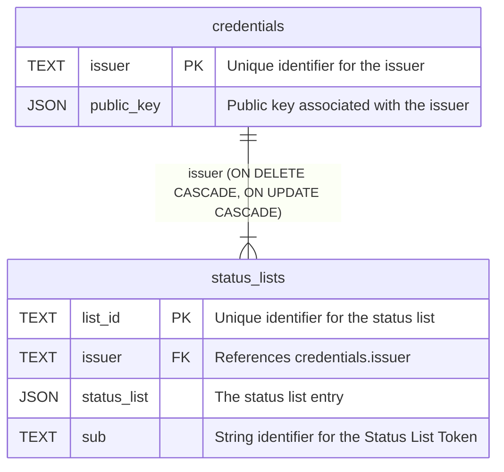

# Database Overview

This document provides an overview of the database schema, including its tables and columns.

Column types are expressed via the sea-orm-migration DSL and map to a
backend-appropriate type per configured `DatabaseBackend` (PostgreSQL, MySQL or
SQLite). Schema identifiers below use the PostgreSQL/TEXT spelling; on other
backends the equivalent native character type is used.

## Tables

### `credentials`

Stores information about issuers and their cryptographic public keys.

| Column       | Type  | Null | Key | Description                           |
| ------------ | ----- | ---- | --- | ------------------------------------- |
| `issuer`     | TEXT  | NO   | PK  | Unique identifier for the issuer      |
| `public_key` | JSON  | NO   |     | Public key associated with the issuer  |

### `status_lists`

Stores status list entries and their associated issuer. Each status list is identified
by its `list_id`, which acts as the primary key.

| Column        | Type  | Null | Key | Description                                          |
| ------------- | ----- | ---- | --- | ---------------------------------------------------- |
| `list_id`     | TEXT  | NO   | PK  | Unique identifier for the status list                |
| `issuer`      | TEXT  | NO   | FK  | References `credentials.issuer` (ON DELETE CASCADE)  |
| `status_list` | JSON  | NO   |     | The status list entry                                |
| `sub`         | TEXT  | NO   |     | String identifier for the Status List Token          |

#### Indexes

The following indexes are created on the `status_lists` table to speed up lookups:

| Index name                 | Column    |
| -------------------------- | --------- |
| `idx_status_lists_list_id` | `list_id` |
| `idx_status_lists_issuer`  | `issuer`  |
| `idx_status_lists_sub`     | `sub`     |

## Entity Relationship Diagram

